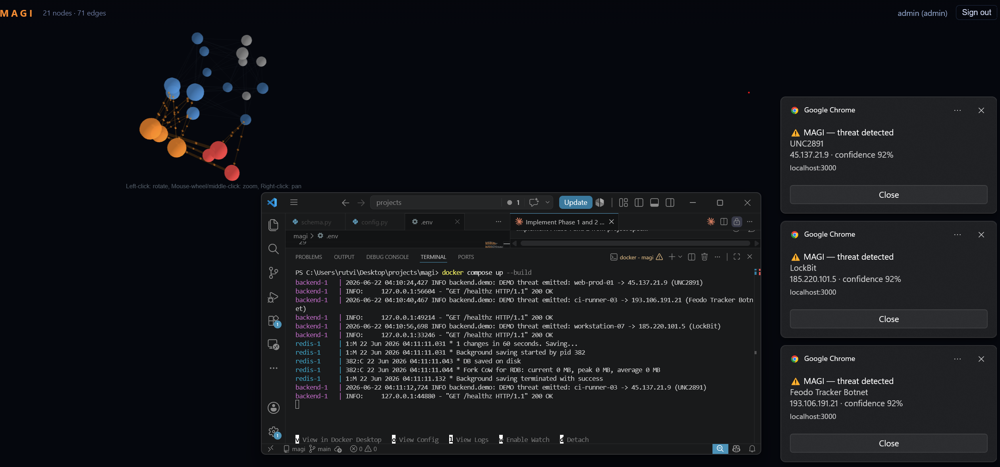

# MAGI — Multi-source Adaptive Graph Intelligence

A distributed, real-time threat-detection and campaign-correlation platform. MAGI
ingests endpoint telemetry from Windows (Sysmon/EVTX) and Linux (eBPF/auditd), maps
relationships in a Neo4j graph, enriches indicators against live OSINT feeds, and
renders the threat landscape as a live 3D force-directed graph over WebSockets.

> Named after the MAGI supercomputer from *Neon Genesis Evangelion* — three specialized
> subsystems reasoning as one: the **Ingest layer** watches, the **Graph Engine**
> reasons, the **Visual Interface** reveals.



---

## Implementation status

| Phase | Scope | Status |
|-------|-------|--------|
| **1** | Dual-platform telemetry ingestion (Windows + Linux collectors) | ✅ implemented |
| **2** | Neo4j graph engine (schema, driver, ingest, lifespan) | ✅ implemented |
| **3** | Threat-intel pipeline & Redis cache | ✅ implemented |
| **4** | FastAPI backend (auth, REST, WebSocket) & React 3D UI | ✅ implemented |
| **5** | Hardening, alerting, observability, Docker | ✅ implemented |

---

## Quick start (dev)

> Requires Python 3.12+ (3.11 also works for the test suite).

```bash
# 1. Environment
python -m venv .venv
source .venv/Scripts/activate          # Windows: .venv\Scripts\activate
pip install -e ".[dev,backend]"        # core + test + enrichment (redis, httpx, …)
#   add the platform extra you need:
pip install -e ".[windows]"            # Windows collector (pywin32)
#   Linux: install bcc from distro packages (NOT pip) — needs kernel headers

# 2. Config
cp .env.example .env                   # then edit secrets
```

### Run a collector (Phase 1 — emits validated JSON to stdout)

```bash
# Windows (run as Administrator; Sysmon >= v15 installed with sysmon_config.xml)
python -m collectors.windows.sysmon_collector

# Linux (root, or: setcap 'cap_bpf,cap_perfmon+ep' $(which python3))
sudo python -m collectors.linux.ebpf_collector
```

### Run the full stack (Phases 2–5)

```bash
# Everything (Neo4j + Redis + backend + frontend) in containers:
docker compose up --build
#   frontend  -> http://localhost:3000   (login, live 3D graph)
#   backend   -> http://localhost:8000   (/healthz, /metrics, /docs)

# First, create the admin login (writes a bcrypt hash):
python -m backend.auth hash 'your-password'    # paste into ADMIN_PASSWORD_HASH in .env
```

### Run backend + frontend separately (dev)

```bash
# Backend (needs Neo4j + Redis — e.g. the test stack):
docker compose -f docker-compose.test.yml up -d
uvicorn backend.main:app --reload
# /healthz -> {"neo4j": "ok", "redis": "ok"}

# Frontend (Vite dev server proxies /auth, /graph, /ws to :8000):
cd frontend && npm install && npm run dev      # http://localhost:3000
```

---

## Tests

```bash
# Unit tests — no external services required
pytest tests/unit -q

# Integration tests — need a live Neo4j (auto-skipped if unreachable)
docker compose -f docker-compose.test.yml up -d
pytest -m integration
```

The unit suite covers schema validation, both collectors' pure parsers, the queue
singleton, config loading, and ingest parameter construction. The integration suite
verifies the Phase 2 acceptance goal: re-ingesting identical events produces **no
duplicate nodes**, and 1,000 events yield the expected node/relationship counts.

---

## Deploying Sysmon (Windows targets)

```powershell
# Install with the MAGI ruleset (elevated)
sysmon64.exe -accepteula -i collectors\windows\sysmon_config.xml
# Update an existing install
sysmon64.exe -c collectors\windows\sysmon_config.xml
```
